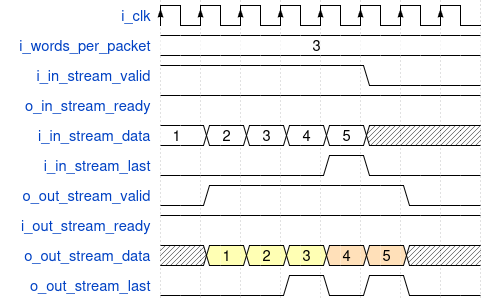

# Stream Segmenter

[Back to **Entity List**](./entity_list.md)

VHDL Source: [stream_segmenter](../modules/stream_segmenter/rtl/stream_segmenter.vhd)

## Description

The component receives an input data stream and segments it into smaller packets.
The maximum number of words per output packet is defined by the _i_words_per_packet_ signal.
When this limit is reached, the component asserts the last signal in the output stream 
to mark the end of the current packet before starting a new one.

If the incoming stream asserts _i_in_stream_last_, this boundary is always preserved 
in the output stream, and segmentation never crosses an explicitly marked end of packet.

In the special case where _i_words_per_packet = 0_, 
the behavior depends on the generic _G_ZERO_WORDS_MODE_:

- "ALWAYS_SEGMENT": behaves as if _i_words_per_packet_ = 1, ensuring each word forms a separate packet with last asserted.
- "NO_SEGMENT": segmentation is disabled, and the input stream is passed through unchanged.

Example waveform for a 5-word input packet with _i_words_per_packet_ = 3:

## Generics

| Name                   | Type     | Default          | Description                                                                                                                                                                                                   |
|:-----------------------|:---------|:-----------------|:--------------------------------------------------------------------------------------------------------------------------------------------------------------------------------------------------------------|
| G_STREAM_WIDTH         | positive | -                | Width of data word in bits                                                                                                                                                                                    |
| G_MAX_WORDS_PER_PACKET | positive | -                | Maximum number of words per packet before segmentation                                                                                                                                                        |
| G_ZERO_WORDS_MODE      | string   | "ALWAYS_SEGMENT" | Defines behavior when i_words_per_packet = 0.  "ALWAYS_SEGMENT" - same as `i_words_per_packet` = 1, `last` is always asserted  "NO_SEGMENT" - disables segmentation and passes data through unchanged |

## Interfaces

### Control

| Name  | In/Out | Length | Default | Description                                       |
|:------|:-------|:-------|:--------|:--------------------------------------------------|
| clk_i | in     | 1      | -       | Clock                                             |
| rst_i | in     | 1      | -       | Reset input (high-active, synchronous to *clk_i*) |

### Static Configuration

| Name               | In/Out | Length                               | Default                | Description                       |
|:-------------------|:-------|:-------------------------------------|:-----------------------|:----------------------------------|
| i_en               | in     | 1                                    | '1'                    | Enables the entity                |
| i_words_per_packet | in     | log2ceil(G_MAX_WORDS_PER_PACKET + 1) | G_MAX_WORDS_PER_PACKET | Sets the maximum words per packet |

### In Stream Interface

| Name              | In/Out | Length         | Default | Description                                                |
|:------------------|:-------|:---------------|:--------|:-----------------------------------------------------------|
| i_in_stream_valid | in     | 1              | '1'     | AXI4-Stream handshaking signal for _i_in_stream_data_      |
| o_in_stream_ready | out    | 1              | N/A     | AXI4-Stream handshaking signal for _i_in_stream_data_      |
| i_in_stream_last  | in     | 1              | '0'     | AXI4-Stream end of packet signaling for _i_in_stream_data_ |
| i_in_stream_data  | in     | G_STREAM_WIDTH | -       | Input data                                                 |

### Out Stream Interface

| Name              | In/Out | Length         | Default | Description                                                |
|:------------------|:-------|:---------------|:--------|:-----------------------------------------------------------|
| o_in_stream_valid | out    | 1              | N/A     | AXI4-Stream handshaking signal for _o_in_stream_data_      |
| i_in_stream_ready | in     | 1              | '1'     | AXI4-Stream handshaking signal for _o_in_stream_data_      |
| o_in_stream_last  | out    | 1              | N/A     | AXI4-Stream end of packet signaling for _o_in_stream_data_ |
| o_in_stream_data  | out    | G_STREAM_WIDTH | N/A     | Output data                                                |